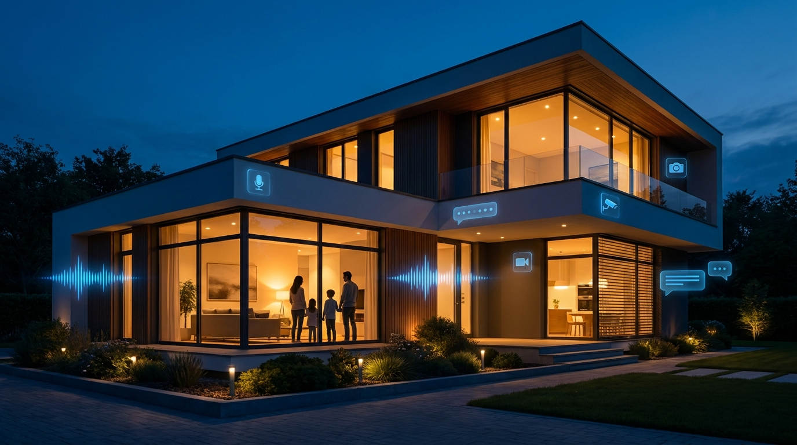

# 🏠 HeimGeist — Euer Zuhause. Eure KI.

Privater KI-Home-Assistent für die ganze Familie — als installierbare **PWA**, komplett **lokal** über [Ollama](https://ollama.com). Keine Cloud, keine Abos, keine Daten verlassen das Haus.



## Features

- 💬 **Familien-Chat** mit lokaler KI (Streaming, schnell)
- 👨‍👩‍👧‍👦 **Familienprofile** — kindgerechte Antworten für Kinder, geduldige für Großeltern
- 🎙️ **Sprachsteuerung** per Browser-Spracherkennung (de-DE), Whisper-ready
- 🏠 **Dashboard** mit Modul-Registry — vorbereitet für Kameras & Automationen
- 📱 **PWA** — auf Handy/Tablet/Desktop installierbar, offline-fähige Shell
- 🔒 **Privat by Design** — Chats bleiben im localStorage des Geräts

## Schnellstart (Heimnetz)

```bash
# Voraussetzung: Ollama läuft (z. B. auf pop-os.local)
ollama serve
ollama pull llama3.1:8b

npm install
npm run dev          # Entwicklung
# oder produktiv:
npm run build && npm start
```

Dann im Heimnetz öffnen (z. B. `http://pop-os.local:3000`), Profil anlegen, unter **Einstellungen** Ollama-Adresse testen und Modell wählen.

## Konfiguration

| Variable | Default | Zweck |
|---|---|---|
| `OLLAMA_BASE_URL` | `http://pop-os.local:11434` | Ollama-Server (serverseitiger Proxy) |

Ohne erreichbares Ollama läuft die App im **Demo-Modus** (z. B. auf Vercel) — ideal als Landing Page + Vorschau.

## Roadmap

1. ✅ **Phase 1:** Familien-Chat, Profile, Dashboard, PWA
2. 🔜 **Phase 2:** Whisper-Sprachsteuerung (faster-whisper, lokal)
3. 🔜 **Phase 3:** Kameras (go2rtc / Frigate)
4. 🔜 **Phase 4:** Automationen (Home-Assistant-Bridge, Function-Calling)

Details: [ARCHITECTURE.md](ARCHITECTURE.md)

## Stack

Next.js 16 (App Router) · React 19 · Tailwind CSS 4 · TypeScript · Ollama

---

Gebaut mit Claude Code + RuFlo-Swarm · Hero-Bild: Higgsfield AI
